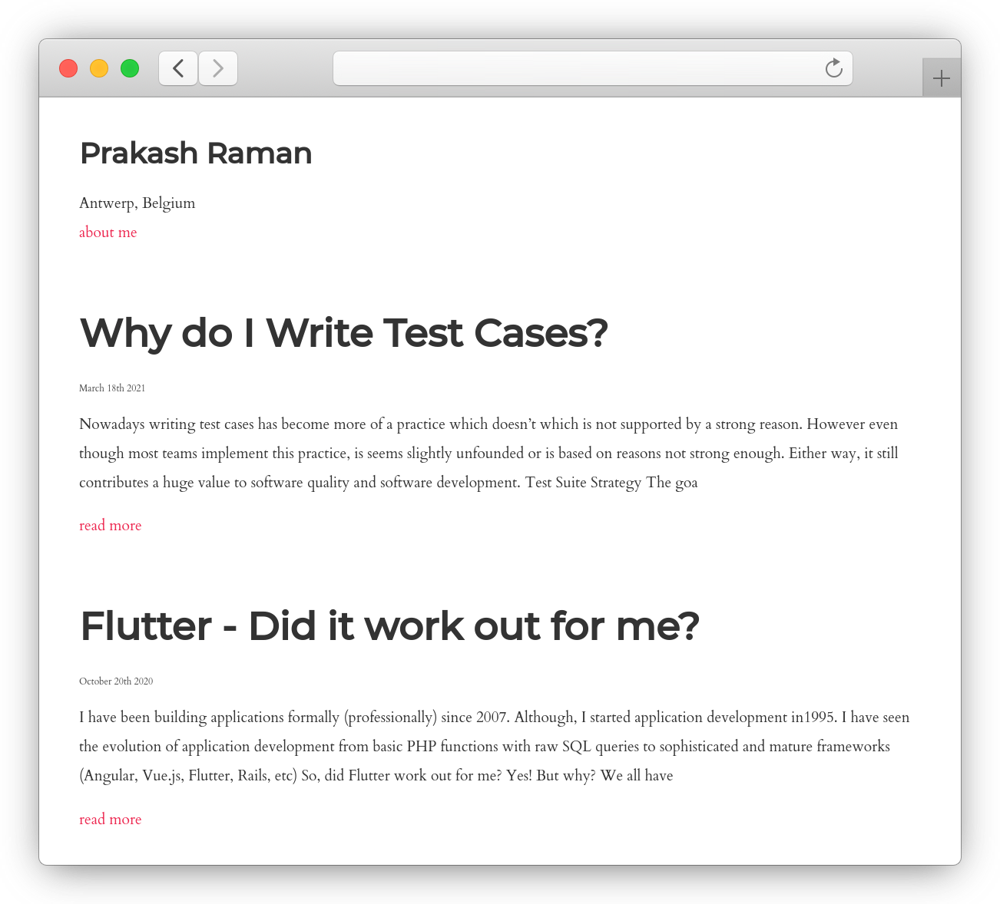

# @prakashraman/notes


[](https://codecov.io/gh/prakashraman/notes)

Build and maintain your blog with just Markdown.

`@prakashraman/notes` is an open-source blogging platform written in TypeScript.

View a running instance at [www.prakashraman.info](http://www.prakashraman.info).



## Installation & basic setup

```sh
npm i --save @prakashraman/notes
npx pr-notes setup # sets up the local json database
npx pr-notes notes:create # creates an article
npx pr-notes publish # build and creates you static website at ./dist
```

## How it works

These commands give complete control over the blog. Namely, `setup`, `notes:create`, `publish`

```
              _
  _ __   ___ | |_ ___  ___
 | '_ \ / _ \| __/ _ \/ __|
 | | | | (_) | ||  __/\__ \
 |_| |_|\___/ \__\___||___/

Usage: npx pr-notes command

Options:
  -h, --help      display help for command

Commands:
  setup           sets up the structure. You don't need to run this more than once
  set:title       sets the title of the homepage
  notes:create    creates a new note
  notes:list      list all the notes
  pages:create    creates a page
  publish         publishes the notes to dist folder
  help [command]  display help for command
```

_Most of the command are interactive_

### Need to know files and folders

| File/Folder              | Comment                                                                                                                                                                        |
| ------------------------ | ------------------------------------------------------------------------------------------------------------------------------------------------------------------------------ |
| ./contents               | Holds all the posts and blog-index-file (manifest.json)                                                                                                                        |
| ./contents/manifest.json | The blog index file. Holds references to all the notes and pages of the blog                                                                                                   |
| ./dist                   | Re-created during the publish/build process. Contains all the viewable articles (converted from Markdown to HTML). This folder can be exported/uploaded as-is to your web host |
| ./dist/index.html        | The home-page of your website                                                                                                                                                  |
| ./contents/header.md     | Website's common header content goes here                                                                                                                                      |
| ./contents/footer.md     | Website's common footer content goes here                                                                                                                                      |
| ./contents/head.html     | HTML code injected at the bottom of the \<head\> tag. Will be present in every html page of the website.                                                                       |

### Create a blog post (note)

```sh
npx pr-notes notes:create
```

Brings up an interactive prompt which asks for the title of the note. Further the platform creates an `.md` file. This markdown file is the where you should enter the contents of your blog post.

### Publish or build the website

```sh
npx pr-notes publish
```

This command deletes and recreates the `./dist` folder. It creates all the required html files with the correct folder orgnanisation. The contents of this folder should ideally be uploaded as-is to your web host

Open `./dist/index.html` in your browser to view your new and improved website!

_Note: `npx pr-notes publish` needs to be run everytime, on making any changes to your notes (markdown files) or any changes to any of the files in your `./content` folder. As it will then re-create your `./dist` folder_

## Deploying the website

As mentioned in the previous section, the idea of this platform is to be able to upload the contents of the `./dist` folder as-is to your web host.

### Easiest way to manage and deploy your website

Github + [Fleek.co](https://fleek.co/)

1. Setup a Github repo for your website
1. Create and maintain the website and all its notes in the repo
1. Setup a `site` on [Fleek.co](http://fleek.co). ([documentation](https://docs.fleek.co/hosting/site-deployment/))
1. Connect your Github account, newly created repo and `main` branch to the Fleek Site.
1. Set the build instruction to `npm install & npx pr-notes publish`.
1. Set the `Publish directory` to `dist`
1. Hit `Deploy Site`

And viola! Your website is now publicly available on the web url mentioned in the Fleek.co site configuration.

Further every time you push changes to your git-repo will automatically trigger a re-build and deploy of your website.

Example:<br>
https://github.com/prakashraman/life-blog is the content repository for [www.prakashraman.info](http://www.prakashraman.info)

_The same process would work with any of the cloud based static site web hosting providers. e,g netlify.com, render.com, surge.sh and many others_


## Roadmap

Upcoming features which I will develop as the need arises. 

* Introduce note.status in Note{}
* Introduce note.isDeleted in Note{}
* Handle pagination for the home page (with a page_size configuration in Manifest{})
